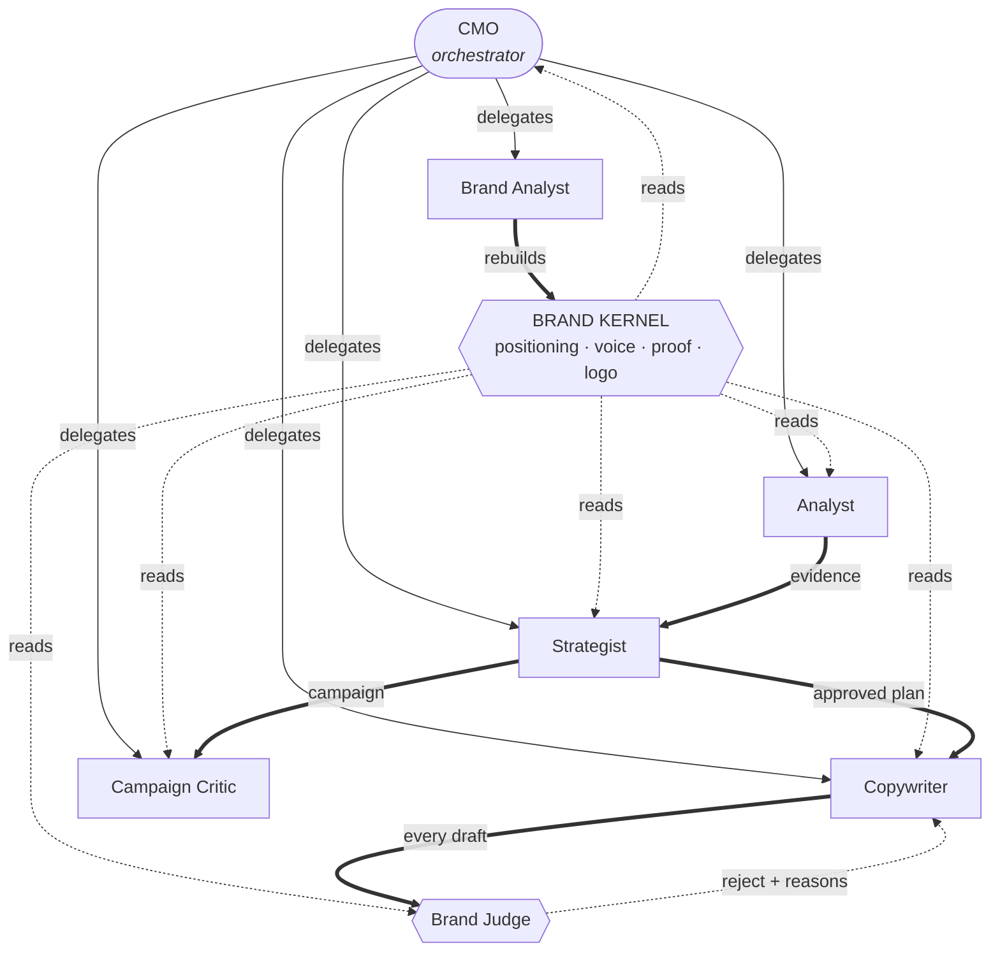

# NorthWind — Agent Network

Seven agents around one shared memory. The **Brand Kernel** is the only source
of truth: every agent reads from it, and none may assert anything it does not
confirm.

---

## The network

**Read the heavy arrows as the chain of work.** Research feeds the plan, the
plan feeds the writing, and nothing written leaves without the judge.

**Read the dotted arrows as memory.** Every agent is grounded in the same
kernel, which is why they never contradict each other about the brand.

---

## Who does what

| Agent | Reads | Produces | Model |
|---|---|---|---|
| **CMO** | Kernel, conversation | The next action, one step at a time | 3.7 Flash |
| **Brand Analyst** | The brand's site and uploads | The Brand Kernel itself | 3.1 Pro |
| **Analyst** | Kernel, live web, owned metrics | Market evidence with citations | 3.6 Flash |
| **Strategist** | Kernel + Analyst evidence | Three options and a dated plan | 3.7 Flash |
| **Copywriter** | Kernel + approved plan | Posts, poster wording, artwork, scripts | 3.6 Flash |
| **Brand Judge** | Kernel + the draft | A verdict with reasons | 3.1 Pro |
| **Campaign Critic** | Kernel + a saved campaign | Pre-flight and post-flight review | 3.1 Pro |

---

## Three interaction patterns

**1 · Delegation is decided live, not planned up front.**
The CMO runs one agent, reads the result, then decides again. If the Analyst
returns nothing, the CMO says so rather than handing empty research to the
Strategist.

**2 · Evidence travels with the work.**
The Strategist never runs alone — the Analyst goes first and its cited findings
are passed in. A plan can therefore point at the evidence behind it, or state
plainly that it is working from assumptions.

**3 · The judge is a gate, not a comment.**
Every draft is scored against the kernel by a *different model from the one that
wrote it*. A failure returns the specific reasons and the Copywriter rewrites,
up to three times. Nothing reaches the user unreviewed.

---

## Live status

Agents report as they work — `queued`, `working`, `completed`, `failed` — and
the conversation shows which one is running and for how long, so a long task is
legible rather than a spinner.

---

## Powered by

<!-- Logo strip: Next.js · React · TypeScript · Vercel · Neon · Prisma · Vercel AI SDK · Google Gemini · sharp -->

| | |
|---|---|
| **Next.js · React · TypeScript** | Application and UI |
| **Vercel** | Hosting and edge runtime |
| **Postgres · Neon** | Brand memory, campaigns, generated media |
| **Prisma** | Data access and migrations |
| **Vercel AI SDK** | Streaming, structured output, tool calls |
| **Google Gemini** | Every agent, with a different model per job |
| **sharp** | Composites the real brand logo onto artwork |
