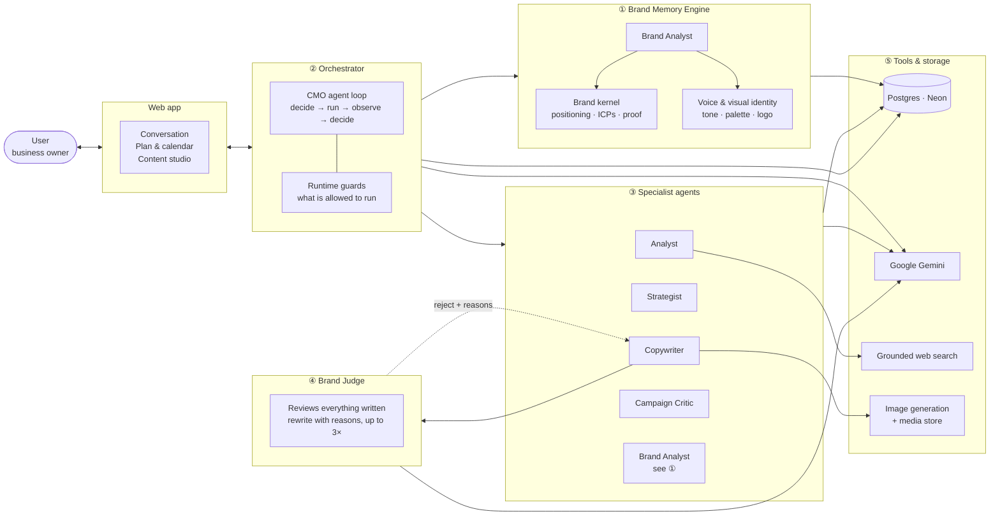

# NorthWind — Architecture

An agentic marketing workspace for small businesses. The owner talks to a **CMO
agent**, which decides for itself which specialists to bring in, and everything
written is checked against the brand's own memory before anyone sees it.

---

## Architecture diagram

---

## Layers

| | Layer | Components | What it does |
|---|---|---|---|
| **L1** | Brand Intelligence | ① | Reads the brand's site and uploads once, and becomes the single source of truth for everything after |
| **L2** | Agent Execution | ② ③ ④ | Decides what to do, does it, and reviews the result before the user sees it |
| **L3** | Tools & Storage | ⑤ | Models, grounded search, database, generated media |

---

## How it flows

**The owner only ever talks to the CMO.** It reads Brand Memory, decides which
of five specialists to run, and hands back a plan or an answer. The Brand
Analyst is one of those five — it is drawn in ① because what it produces *is*
Brand Memory.

**The CMO is a loop, not a router.** Most assistants decide everything up front
then execute blindly. This one runs a step, looks at the result, and decides
again — so when research comes back empty it *says so* instead of building a
plan on nothing.

**Guards sit in the runtime, not the prompt.** It will not build a campaign plan
before the user has agreed to one, and it will not write content off an
unapproved plan. The model proposes; the code enforces.

**Nothing published is unreviewed.** Every caption, poster and script is scored
against the brand's confirmed memory by a *different model from the one that
wrote it*. Failures are rewritten with the reasons attached.

---

## Tech stack

| Layer | Choice |
|---|---|
| App | Next.js · React · TypeScript |
| Data | Postgres (Neon) via Prisma |
| AI | Google Gemini via the Vercel AI SDK |
| Images | Gemini image models · brand logo composited with sharp |
| Hosting | Vercel |

## The models

Different jobs need different models. The judge is deliberately never the model
that wrote the draft.

| Agent | Model | Job |
|---|---|---|
| CMO | Gemini 3.7 Flash | Decides each step of the conversation |
| Analyst | Gemini 3.6 Flash | Market research with grounded web search |
| Strategist | Gemini 3.7 Flash | Builds the campaign plan and options |
| Copywriter | Gemini 3.6 Flash | Writes posts, poster wording, video scripts |
| Poster artwork | Gemini 3.1 Flash Image | Generates the poster image |
| Brand Analyst | Gemini 3.1 Pro | Reads the brand's site and files |
| Brand Judge | Gemini 3.1 Pro | Reviews everything written |
| Campaign Critic | Gemini 3.1 Pro | Pre-flight and post-flight campaign review |

Cost is tracked per turn and shown to the user: a question costs about **RM0.02**,
a full campaign plan about **RM0.13**.

---

## Principles

1. **The runtime decides what runs, not the model.** The model proposes; the
   code enforces.
2. **Fail closed on anything the user will publish.** Unreviewed content is
   never reported as approved.
3. **Brand Memory is the only source of truth.** Agents may not invent prices,
   dates, results or claims it does not confirm.
4. **Say what is missing.** No research is reported as no research, not filled
   in with plausible prose.
