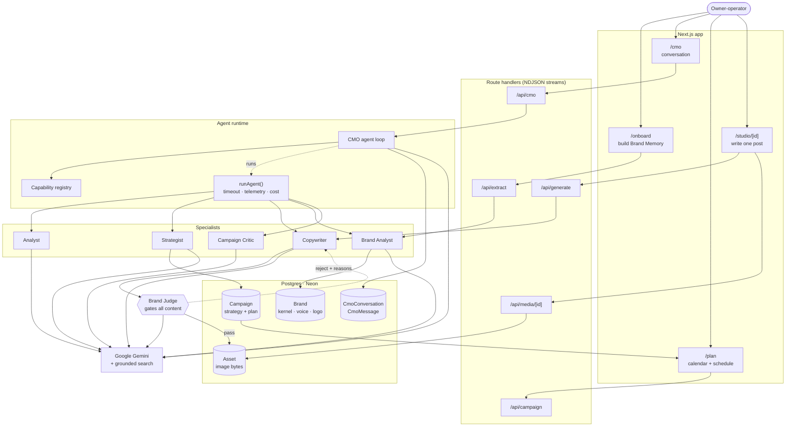
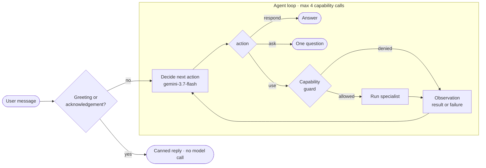
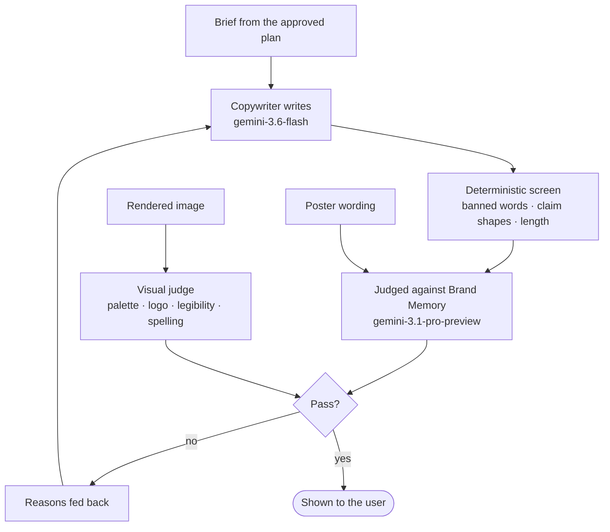
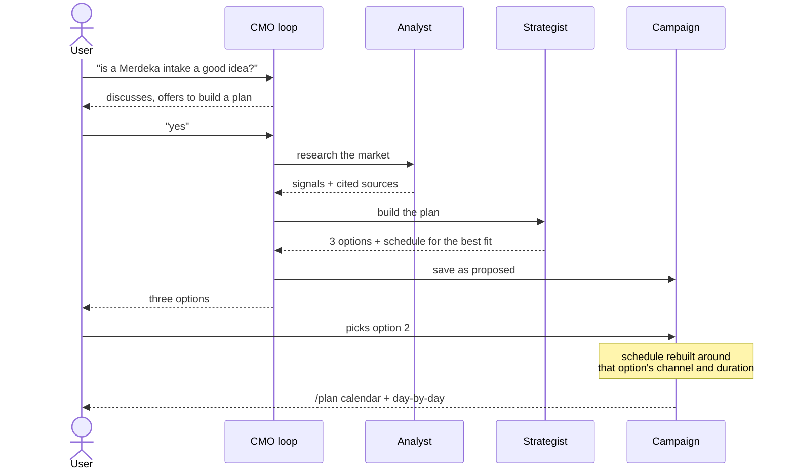
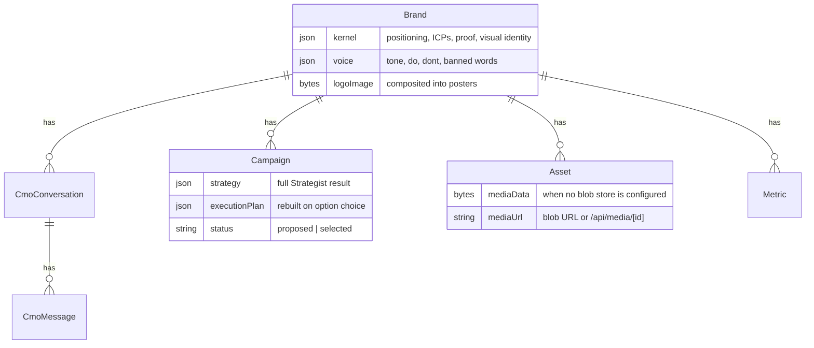

# NorthWind — Architecture

An agentic marketing workspace. A small-business owner talks to a **CMO agent**,
which decides one step at a time which specialists to run, and every piece of
content produced is reviewed against the brand's own memory before the user
sees it.

---

## 1. The whole system

---

## 2. The CMO is a loop, not a router

The defining decision. The CMO does **not** plan a turn up front and execute it
blindly — it decides, runs one capability, observes the result, and decides
again, up to a step budget.

**Why a loop.** The Analyst can return zero sources; the loop sees that and
says so instead of planning on nothing. A single-shot router cannot react to
its own results.

**Guards are feedback, not deletion.** A refused call returns its reason as an
observation — *"the user has not agreed to a plan yet"* — so the model chooses
something else. Silently stripping the call left it unaware.

| Guard | Rule |
|---|---|
| Plan gate | Strategist only runs once the user asks for or agrees to a plan |
| Mutual exclusion | Copywriter never runs in the same turn as the Strategist |
| Duplicate work | Analyst refused after the Strategist, which researches itself |
| Step budget | 4 capability calls, then it must answer |
| Catalogue check | Invented product names dropped before delegation |

Adding a specialist means one entry in `cmo/registry.ts`. The prompt's
specialist menu is generated from it.

---

## 3. Every piece of content is judged

Nothing reaches the user unreviewed. The judge runs on a **different model**
from the writer.

**Two layers.** Objective rules are deterministic and free — banned words,
regulated terms, unevidenced claim shapes, channel length. Judgement needs a
model: positioning, audience, evidence, tone, each scored against the brand's
confirmed memory with a stated reason.

**The judge sees exactly what the writer saw.** Giving it a narrower slice made
it reject copy for citing confirmed pricing the brief had supplied.

**It fails closed.** If the judge cannot be reached, content is marked *not
reviewed* rather than passed — the deterministic rules alone score clean copy
around 98, which would have been a silent green tick.

---

## 4. Where the plan comes from

The Strategist only ever schedules **its own recommended option**, so choosing a
different one recomputes the dates, cadence, channel and measurement.

---

## 5. Runtime facts

| Agent | Model | Budget | Notes |
|---|---|---|---|
| CMO | `gemini-3.7-flash` | 150s | Loop, up to 4 capability calls |
| Analyst | `gemini-3.6-flash` | 40s | Grounded search + optional connectors |
| Strategist | `gemini-3.7-flash` | 85s | Structured output, deterministic fallback |
| Copywriter | `gemini-3.6-flash` | 200s | Text, poster, script — worst case 3 renders |
| Copywriter (image) | `gemini-3.1-flash-image` | — | Poster artwork |
| Brand Analyst | `gemini-3.1-pro-preview` | 110s | Crawls the site, rebuilds memory |
| Brand Judge | `gemini-3.1-pro-preview` | — | Never the model that wrote the draft |
| Campaign Critic | `gemini-3.1-pro-preview` | 20s | Pre-flight and post-flight review |

`runAgent()` wraps every call with a timeout, prices it against that model's own
rate, and returns telemetry. The CMO aggregates the whole turn, so the chat
footer shows real spend: a question ≈ RM0.02, a full plan ≈ RM0.13.

---

## 6. Data

**Brand Memory** is the single source of truth. Agents may only assert what it
confirms; anything else must be hedged or refused.

**The logo is stored, not described.** Posters composite the real file — an
image model asked to redraw a mark from words never reproduces it.

---

## 7. Principles worth keeping

1. **The runtime decides what runs, not the model.** The model proposes; guards
   in code enforce. Every guard exists because a rule in the prompt was broken.
2. **Fail closed on anything the user will publish.** Unreviewed content is
   never reported as approved.
3. **Deterministic where possible, model where necessary.** Word counts and
   banned terms need no model. Positioning and tone do.
4. **Degrade, don't dead-end.** A poster that never passes returns its best
   attempt with the concerns attached, because the wording gate already cleared
   the claims.
5. **Say what is missing.** No research is reported as no research, not
   filled in with plausible prose.
