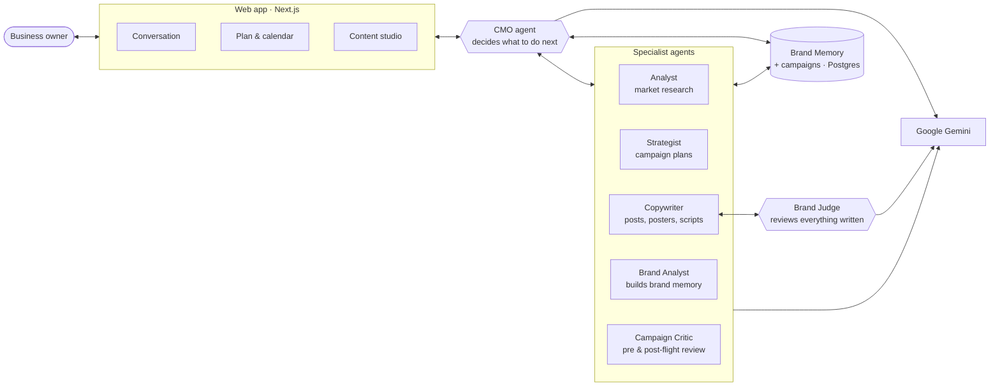
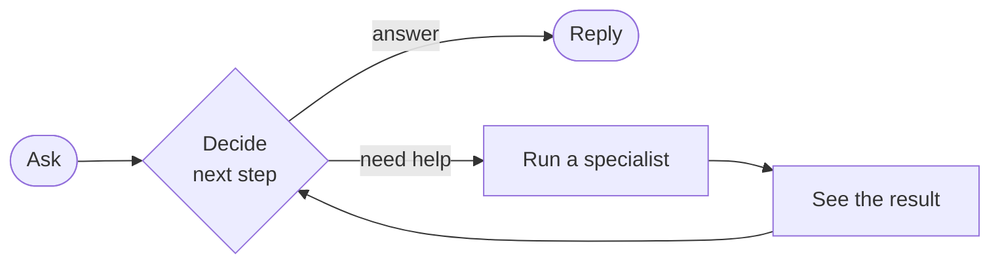

# NorthWind — Architecture

An agentic marketing workspace for small businesses. The owner talks to a **CMO
agent**, which decides for itself which specialists to bring in, and everything
it writes is checked against the brand's own memory before anyone sees it.

---

## The system

**How it hangs together.** The owner only ever talks to the CMO. It reads Brand
Memory, decides which specialists to run, and hands back a plan or an answer.
Anything the Copywriter produces goes past the Brand Judge before it is shown.

---

## The idea that matters: the CMO is a loop, not a router

Most assistants decide everything up front and then execute blindly. The CMO
runs one step, looks at the result, and decides again.

Why it matters: if research comes back empty, the CMO **says so** instead of
building a plan on nothing. A one-shot planner cannot react to its own results.

The runtime, not the model, decides what is allowed to run — it will not build a
campaign plan before the user has agreed to one, and it will not write content
off an unapproved plan.

---

## Nothing published is unreviewed

Every caption, poster and script is scored against the brand's confirmed memory
by a **different model from the one that wrote it**, on voice, positioning,
audience, evidence, tone, and — for posters — colour, logo, readability and
spelling. Anything that fails is rewritten with the reasons attached, up to
three times.

If the judge cannot be reached, content is marked *not reviewed* rather than
passed.

---

## Tech stack

| Layer | Choice |
|---|---|
| App | Next.js · React · TypeScript |
| Data | Postgres (Neon) via Prisma |
| AI | Google Gemini via the Vercel AI SDK |
| Images | Gemini image models, brand logo composited with sharp |
| Hosting | Vercel |

## The models

Different jobs need different models. The judge is deliberately never the model
that wrote the draft.

| Agent | Model | Job |
|---|---|---|
| CMO | Gemini 3.7 Flash | Decides each step of the conversation |
| Analyst | Gemini 3.6 Flash | Market research with grounded web search |
| Strategist | Gemini 3.7 Flash | Builds the campaign plan and options |
| Copywriter | Gemini 3.6 Flash | Writes posts, poster wording, video scripts |
| Poster artwork | Gemini 3.1 Flash Image | Generates the poster image |
| Brand Analyst | Gemini 3.1 Pro | Reads the brand's site and files |
| Brand Judge | Gemini 3.1 Pro | Reviews everything written |

Cost is tracked per turn and shown to the user: a question costs about RM0.02, a
full campaign plan about RM0.13.

---

## Principles

1. **The runtime decides what runs, not the model.** The model proposes; the
   code enforces.
2. **Fail closed on anything the user will publish.** Unreviewed content is
   never reported as approved.
3. **Brand Memory is the only source of truth.** Agents may not invent prices,
   dates, results or claims it does not confirm.
4. **Say what is missing.** No research is reported as no research, not filled
   in with plausible prose.
